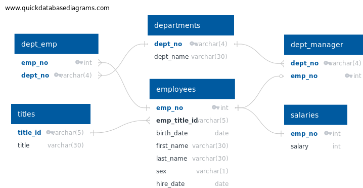

# SQL Data Analysis Project

## Overview/Purpose

Welcome to the SQL Data Analysis Project repository! As a newly hired data engineer at Pewlett Hackard, my primary task was to conduct a research project focusing on the employees who worked at the company during the 1980s and 1990s. The project involves data modeling, data engineering, and data analysis using six CSV files containing historical employee data. The goal is to import the CSV files into a SQL database, design appropriate table schemas, and perform various data analysis tasks to extract valuable insights from the dataset.

## Important Findings

### Data Modeling

- Inspected the CSV files and sketched an Entity Relationship Diagram (ERD) to visualize the tables' relationships and structure.
- Designed table schemas for each CSV file, specifying data types, primary keys, foreign keys, and other constraints.

### Data Engineering

- Created SQL tables for each CSV file, ensuring proper handling of primary keys, foreign keys, and table relationships.
- Imported data from the CSV files into their corresponding SQL tables, maintaining data integrity and consistency.

### Data Analysis

- Listed employee details such as employee number, last name, first name, sex, and salary for each employee.
- Extracted information about employees hired in 1986, including their first name, last name, and hire date.
- Identified the manager of each department along with their department number, department name, employee number, last name, and first name.
- Listed the department number for each employee along with their employee number, last name, first name, and department name.
- Filtered employees named Hercules with a last name starting with the letter B, listing their first name, last name, and sex.
- Compiled a list of employees in the Sales department, including their employee number, last name, and first name.
- Retrieved employees in the Sales and Development departments, providing their employee number, last name, first name, and department name.
- Conducted a frequency count of all employee last names to determine how many employees share each last name.

## Summary

This project at Pewlett Hackard involves comprehensive data analysis of historical employee data from the 1980s and 1990s. By leveraging SQL, data modeling, and data engineering techniques, valuable insights have been extracted regarding employee details, department management, hiring trends, and employee name distributions. The analysis provides a foundation for further research and decision-making processes within the organization.

## Technical Details

- Utilized SQL to design table schemas, import data, and perform data analysis queries.
- Employed tools like QuickDBD for creating Entity Relationship Diagrams (ERDs) to visualize table structures.
- Executed SQL queries to extract specific information from the database, fulfilling the requirements outlined in the project instructions.

For more detailed technical information, please refer to the provided schema and SQL queries.
